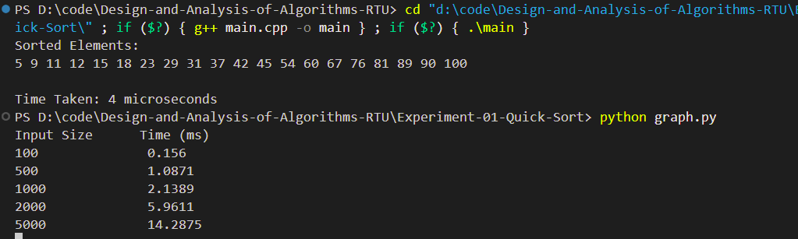
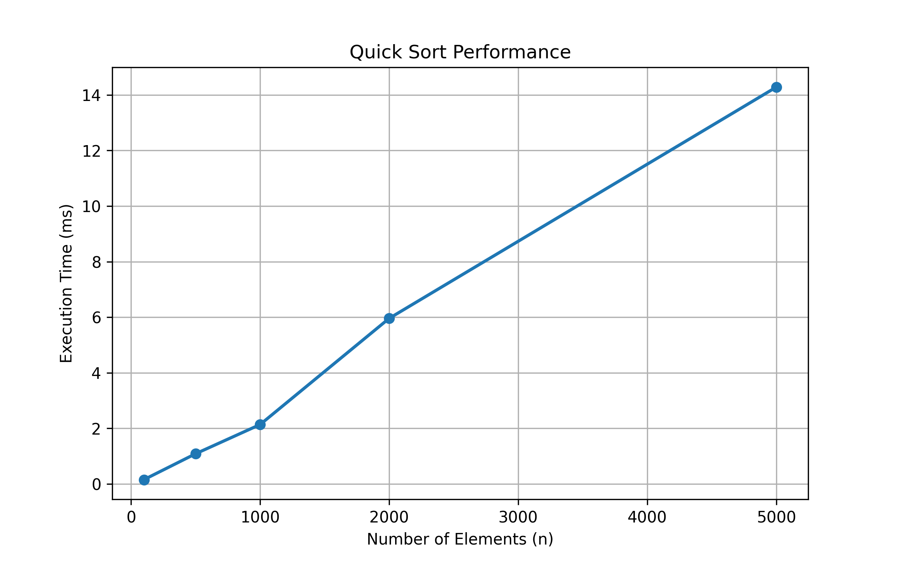

# Experiment 01 - Quick Sort Algorithm

## Aim

Sort a given set of elements using the Quicksort method and determine the time required to sort the elements. Repeat the experiment for different values of **n**, the number of elements in the list to be sorted and plot a graph of the time taken versus **n**. The elements can be read from a file or can be generated using the random number generator.

---

## Objective

To study and implement the Quick Sort algorithm and analyze its execution time for sorting a list of elements.

---

## Theory

Quick Sort is a **Divide and Conquer** algorithm.

It works by selecting a pivot element and partitioning the array into two parts:

- Elements smaller than the pivot
- Elements greater than the pivot

The same process is recursively applied to both subarrays until the array becomes sorted.

### Time Complexity

| Case | Complexity |
|------|------------|
| Best Case | O(n log n) |
| Average Case | O(n log n) |
| Worst Case | O(n²) |

### Space Complexity

**O(log n)**

---

## Algorithm

1. Read input elements from a file.
2. Select the last element as the pivot.
3. Partition the array around the pivot.
4. Recursively apply Quick Sort to the left subarray.
5. Recursively apply Quick Sort to the right subarray.
6. Measure the execution time.
7. Repeat the experiment for different input sizes.
8. Plot the graph of execution time versus number of elements.

---

## Files Included

- **main.cpp** – Quick Sort implementation
- **input.txt** – Sample input dataset
- **graph.py** – Python program to generate performance graph
- **output_1.png** – Program output screenshot
- **graph.png** – Performance graph
- **README.md** – Project documentation

---

## Input

The input values are stored in **input.txt**.

Example:

```text
45
12
67
89
23
11
90
54
31
76
9
5
18
29
60
100
42
37
81
15
```

---

## Output

The program displays:

- Original input elements
- Sorted elements using Quick Sort
- Execution time in microseconds

### Output Screenshot

<p align="center">
    
</p>

---

## Performance Graph

The execution time of the Quick Sort algorithm was measured for different input sizes. The graph below shows how the execution time increases as the number of elements increases.

<p align="center">
    
</p>

---

## Requirements

- C++ Compiler (G++)
- VS Code / CodeBlocks / Dev C++
- Python 3.x (for graph generation)
- Matplotlib

Install matplotlib:

```bash
pip install matplotlib
```

---

## How to Run

### Compile

```bash
g++ main.cpp -o quicksort
```

### Run

Windows

```bash
quicksort.exe
```

Linux / macOS

```bash
./quicksort
```

### Generate Performance Graph

```bash
python graph.py
```

---

## Applications

- Database Sorting
- Search Algorithms
- Data Processing
- Competitive Programming
- Operating Systems
- Compiler Design

---

## Advantages

- Fast sorting algorithm
- Efficient for large datasets
- In-place sorting
- Widely used in real-world applications

---

## Limitations

- Worst-case complexity is O(n²)
- Recursive implementation may consume stack memory
- Performance depends on pivot selection

---

## Result

The Quick Sort algorithm was successfully implemented using C++. The input data was sorted correctly, the execution time was measured for different input sizes, and the performance graph was generated successfully.

---

## Keywords

Analysis of Algorithms, Design and Analysis of Algorithms, Quick Sort, Divide and Conquer, C++, RTU Lab, DAA Lab, Sorting Algorithm, Performance Analysis, Time Complexity, Graph Analysis
