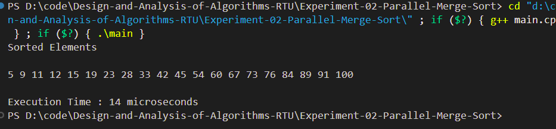
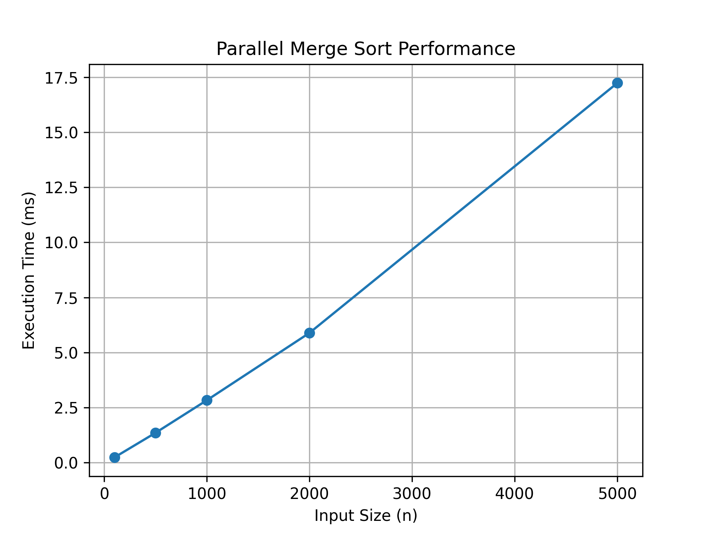

# Experiment 02 - Parallel Merge Sort Algorithm

## Aim

Implement a parallelized Merge Sort algorithm to sort a given set of elements and determine the time required to sort the elements. Repeat the experiment for different values of **n**, the number of elements in the list to be sorted, and plot a graph of the time taken versus **n**. The elements can be read from a file or can be generated using the random number generator.

---

## Objective

To study and implement the Parallel Merge Sort algorithm and analyze its execution time for different input sizes using multithreading.

---

## Theory

Parallel Merge Sort is an efficient Divide and Conquer sorting algorithm that improves performance by executing recursive sorting operations concurrently using multiple threads.

The algorithm recursively divides the array into two halves until each subarray contains a single element. The subarrays are then merged in sorted order. By processing the left and right halves simultaneously, the algorithm can reduce execution time on multi-core processors.

### Time Complexity

| Case | Complexity |
|------|------------|
| Best Case | **O(n log n)** |
| Average Case | **O(n log n)** |
| Worst Case | **O(n log n)** |

### Space Complexity

**O(n)**

---

## Algorithm

1. Read input elements from the input file.
2. Divide the array into two equal halves.
3. Create parallel threads to sort each half recursively.
4. Merge the sorted halves into a single sorted array.
5. Measure the execution time.
6. Repeat the experiment for different values of **n**.
7. Plot the graph of execution time versus input size.

---

## Files Included

- **main.cpp** – Parallel Merge Sort implementation
- **input.txt** – Sample input dataset
- **graph.py** – Performance graph generation script
- **output_1.png** – Program output screenshot
- **graph.png** – Performance graph
- **README.md** – Project documentation

---

## Input

The input values are stored in **input.txt**.

Example:

```text
45
23
12
89
54
76
11
9
100
67
42
19
5
33
91
60
28
73
84
15
```

---

## Output

The program displays:

- Original input elements
- Sorted elements using Parallel Merge Sort
- Execution time in microseconds

### Output Screenshot

<p align="center">
    
</p>

---

## Performance Graph

The execution time of the Parallel Merge Sort algorithm was measured for different input sizes. The graph below illustrates how the execution time varies as the number of elements increases.

<p align="center">
    
</p>

---

## Requirements

- C++ Compiler (G++)
- VS Code / CodeBlocks / Dev C++
- Python 3.x
- Matplotlib

Install Matplotlib:

```bash
pip install matplotlib
```

---

## How to Run

### Compile

```bash
g++ main.cpp -o mergesort
```

### Run

Windows

```bash
mergesort.exe
```

Linux / macOS

```bash
./mergesort
```

### Generate Performance Graph

```bash
python graph.py
```

---

## Applications

- Parallel Computing
- High Performance Computing (HPC)
- Database Systems
- Large Dataset Processing
- Cloud Computing
- Distributed Systems

---

## Advantages

- Faster execution on multi-core processors
- Stable sorting algorithm
- Efficient for large datasets
- Predictable O(n log n) performance

---

## Limitations

- Requires additional memory
- Thread creation introduces overhead for small datasets
- Performance depends on available CPU cores

---

## Result

The Parallel Merge Sort algorithm was successfully implemented using C++. The input data was sorted correctly, execution time was measured for different input sizes, and the performance graph was generated successfully.

---

## Keywords

Analysis of Algorithms, Design and Analysis of Algorithms, Parallel Merge Sort, Merge Sort, Divide and Conquer, Multithreading, C++, RTU Lab, DAA Lab, Sorting Algorithm, Performance Analysis, Time Complexity