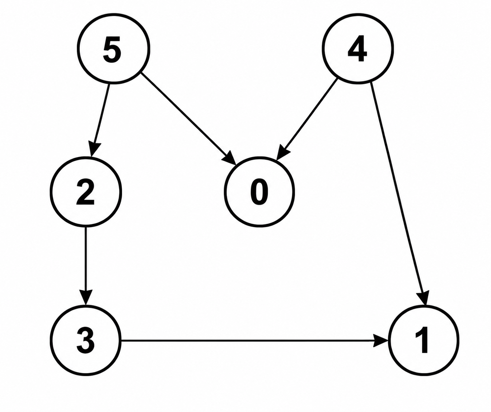
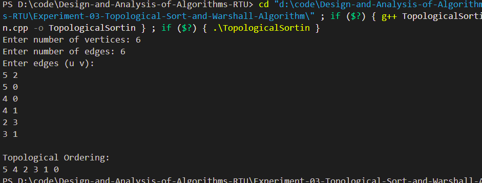
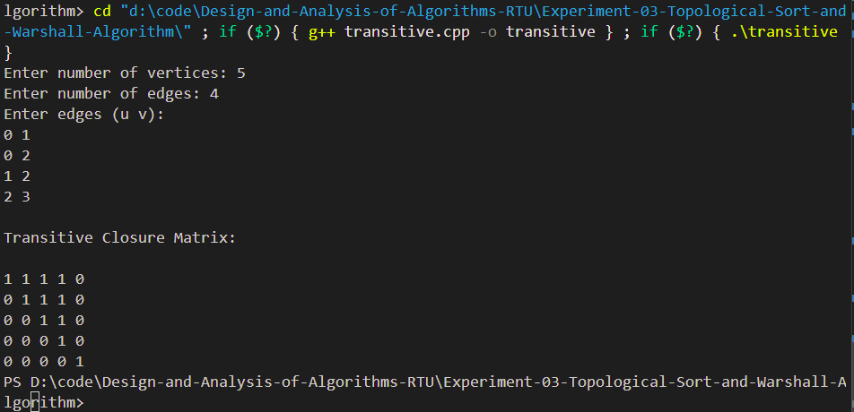

# Experiment 03 - Topological Sorting and Warshall's Algorithm

## Aim

a. Obtain the Topological ordering of vertices in a given digraph.

b. Compute the transitive closure of a given directed graph using Warshall's algorithm.

---

## Objective

To study and implement the Topological Sorting algorithm for Directed Acyclic Graphs (DAGs) and compute the transitive closure of a directed graph using Warshall's Algorithm.

---

## Theory

### Part A - Topological Sorting

Topological Sorting is a linear ordering of vertices in a Directed Acyclic Graph (DAG) such that for every directed edge **u → v**, vertex **u** appears before **v** in the ordering.

Topological Sorting is possible only for Directed Acyclic Graphs.

Applications include:

- Task Scheduling
- Course Prerequisite Planning
- Dependency Resolution
- Build Systems
- Project Scheduling

---

### Part B - Warshall's Algorithm

Warshall's Algorithm is used to compute the **Transitive Closure** of a directed graph.

The transitive closure determines whether a path exists between every pair of vertices in the graph.

The algorithm is based on Dynamic Programming and repeatedly updates the reachability matrix.

---

## Time Complexity

| Algorithm | Time Complexity |
|------------|-----------------|
| Topological Sort | **O(V + E)** |
| Warshall's Algorithm | **O(V³)** |

---

## Algorithm

### Part A – Topological Sorting

1. Read the graph.
2. Perform Depth First Search (DFS).
3. Push each completely visited vertex into a stack.
4. Pop all vertices from the stack.
5. Display the Topological Ordering.

---

### Part B – Warshall's Algorithm

1. Read the directed graph.
2. Construct the adjacency matrix.
3. Initialize the reachability matrix.
4. Update paths using every intermediate vertex.
5. Display the Transitive Closure Matrix.

---

## Files Included

- **topological_sort.cpp** – Topological Sorting implementation
- **warshall_algorithm.cpp** – Warshall's Algorithm implementation
- **input_topological.txt** – Sample input for Topological Sorting
- **input_warshall.txt** – Sample input for Warshall's Algorithm
- **output_1.png** – Topological Sorting output
- **output_2.png** – Warshall Algorithm output
- **README.md** – Project documentation

---

## Sample Input

### Topological Sorting

```text
6
6
5 2
5 0
4 0
4 1
2 3
3 1
```

### Warshall Algorithm

```text
4
5
0 1
0 2
1 2
2 3
3 1
```

---

## Output

### Part A – Topological Sorting

The program displays a valid Topological Ordering of the given Directed Acyclic Graph.

### Sample DAG

<p align="center">
    
</p>

### Output Screenshot

<p align="center">
    
</p>

---

### Part B – Warshall's Algorithm

The program computes the Transitive Closure Matrix of the directed graph.

### Output Screenshot

<p align="center">
    
</p>
---

## Sample Directed Acyclic Graph (DAG)

The following Directed Acyclic Graph (DAG) is used to demonstrate the working of the Topological Sorting algorithm.

<p align="center">
    
</p>

### Graph Edges

- 5 → 2
- 5 → 0
- 4 → 0
- 4 → 1
- 2 → 3
- 3 → 1

---

## Requirements

- C++ Compiler (G++)
- VS Code / CodeBlocks / Dev C++

---

## How to Run

### Compile Topological Sort

```bash
g++ topological_sort.cpp -o topo
```

Run

```bash
topo.exe
```

---

### Compile Warshall Algorithm

```bash
g++ warshall_algorithm.cpp -o warshall
```

Run

```bash
warshall.exe
```

---

## Applications

### Topological Sorting

- Task Scheduling
- Course Scheduling
- Compiler Design
- Build Systems
- Dependency Management

### Warshall's Algorithm

- Network Routing
- Graph Reachability
- Database Query Optimization
- Social Network Analysis
- Graph Connectivity Problems

---

## Advantages

### Topological Sorting

- Efficient for Directed Acyclic Graphs
- Simple implementation using DFS
- Useful in scheduling and dependency analysis

### Warshall's Algorithm

- Computes complete reachability
- Easy to implement
- Suitable for dense graphs

---

## Limitations

### Topological Sorting

- Applicable only to Directed Acyclic Graphs (DAGs)

### Warshall's Algorithm

- Requires O(V³) time complexity
- Less efficient for very large graphs

---

## Result

The Topological Sorting algorithm successfully generated a valid ordering of vertices for the given Directed Acyclic Graph. Warshall's Algorithm successfully computed the Transitive Closure Matrix, indicating the reachability between all pairs of vertices.

---

## Keywords

Design and Analysis of Algorithms, Analysis of Algorithms, Topological Sort, Warshall Algorithm, Directed Graph, DAG, Transitive Closure, Dynamic Programming, Graph Algorithms, C++, RTU Lab, DAA Lab
