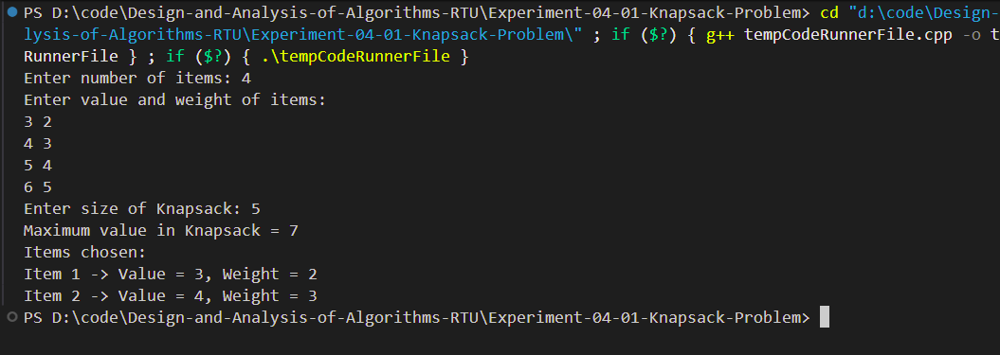

# Experiment 04 - 0/1 Knapsack Problem using Dynamic Programming

## Aim

Implement the 0/1 Knapsack Problem using Dynamic Programming.

---

## Objective

To understand the Dynamic Programming approach for solving the 0/1 Knapsack optimization problem.

---

## Theory

The 0/1 Knapsack Problem is a classical optimization problem in Dynamic Programming.

Each item can either be:

- Included (1)
- Excluded (0)

The objective is to maximize the total value without exceeding the capacity of the knapsack.

---

## Time Complexity

- **O(n × W)**

where

- n = Number of Items
- W = Knapsack Capacity

---

## Space Complexity

- **O(n × W)**

---

## Algorithm

1. Read the number of items.
2. Read weights and values.
3. Read knapsack capacity.
4. Create a DP table.
5. Fill the table using Dynamic Programming.
6. Print the maximum obtainable profit.

---

## Files Included

- **main.cpp** – 0/1 Knapsack implementation
- **input.txt** – Sample input
- **output_1.png** – Output screenshot
- **README.md** – Documentation

---

## Sample Input

```text
4

2
3
4
5

3
4
5
6

5
```

---

## Sample Output

```text
Maximum Profit = 7
```

### Output Screenshot

<p align="center">

</p>

---

## Requirements

- C++ Compiler
- VS Code
- g++

---

## How to Run

Compile

```bash
g++ main.cpp -o knapsack
```

Run

```bash
knapsack.exe
```

---

## Applications

- Resource Allocation
- Budget Optimization
- Cargo Loading
- Investment Planning
- Project Selection

---

## Advantages

- Guarantees Optimal Solution
- Efficient Dynamic Programming approach
- Widely used optimization algorithm

---

## Limitations

- High memory usage for large capacities
- Applicable only to 0/1 selection problems

---

## Result

The 0/1 Knapsack Problem was successfully implemented using Dynamic Programming. The maximum achievable profit was calculated correctly.

---

## Keywords

Design and Analysis of Algorithms, Dynamic Programming, 0/1 Knapsack, Optimization, C++, RTU Lab, DAA Lab