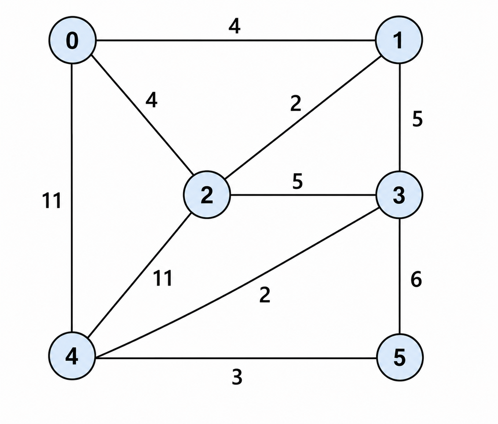
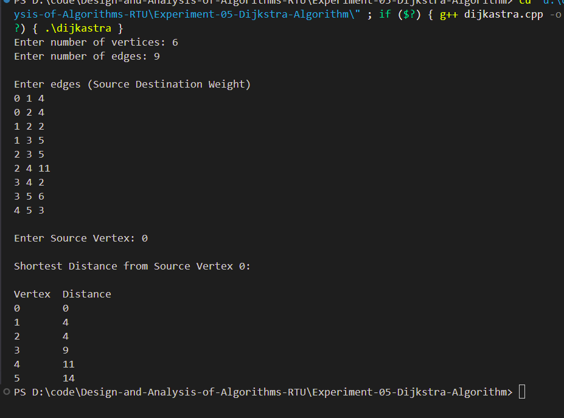

# Experiment 05 - Dijkstra's Algorithm

## Aim

From a given vertex in a weighted connected graph, find shortest paths to other vertices using Dijkstra's algorithm. 

---

## Objective

To implement Dijkstra's Algorithm for finding the shortest path from a source vertex to all other vertices in a weighted connected graph.

---

## Theory

Dijkstra's Algorithm is a greedy graph algorithm used to find the shortest distance between a source vertex and all other vertices in a weighted graph with non-negative edge weights.

The algorithm repeatedly selects the vertex with the minimum tentative distance and updates the distances of its adjacent vertices.

---

## Time Complexity

- **Using Priority Queue:** O((V + E) log V)

Where:

- **V** = Number of Vertices
- **E** = Number of Edges

---

## Space Complexity

- **O(V + E)**

---

## Algorithm

1. Read the number of vertices and edges.
2. Construct the weighted graph using an adjacency list.
3. Initialize all distances as infinity.
4. Set the source vertex distance to 0.
5. Use a priority queue to repeatedly select the minimum distance vertex.
6. Relax all adjacent edges.
7. Print the shortest distance from the source to every vertex.

---

## Files Included

- **main.cpp** – Dijkstra's Algorithm implementation
- **input.txt** – Sample input graph
- **graph.png** – Weighted graph used for the experiment
- **output_1.png** – Program output screenshot
- **README.md** – Project documentation

---

## Graph Used

<p align="center">

</p>

---

## Sample Input

```text
6
9

0 1 4
0 2 4
1 2 2
1 3 5
2 3 5
2 4 11
3 4 2
3 5 6
4 5 3

0
```

---

## Sample Output

```text
Shortest Distance from Source Vertex 0

Vertex    Distance
0         0
1         4
2         4
3         9
4         11
5         14
```

---

## Output Screenshot

<p align="center">

</p>

---

## Requirements

- C++ Compiler
- VS Code / CodeBlocks
- g++

---

## How to Run

### Compile

```bash
g++ main.cpp -o dijkstra
```

### Run

```bash
./dijkstra
```

Windows

```bash
dijkstra.exe
```

---

## Applications

- GPS Navigation Systems
- Network Routing
- Robot Path Planning
- Airline Route Optimization
- Social Network Analysis
- Maps and Navigation Software

---

## Advantages

- Finds the shortest path efficiently.
- Works well for graphs with non-negative edge weights.
- Simple and widely used graph algorithm.
- Efficient using Priority Queue.

---

## Limitations

- Does not work with negative edge weights.
- Cannot detect negative weight cycles.

---

## Result

The Dijkstra's Algorithm was successfully implemented using C++. The program correctly calculated the shortest distance from the selected source vertex to all other vertices in the weighted graph.

---

## Keywords

Design and Analysis of Algorithms, Dijkstra Algorithm, Shortest Path, Graph Algorithm, Greedy Algorithm, Weighted Graph, C++, RTU Lab, DAA Lab
