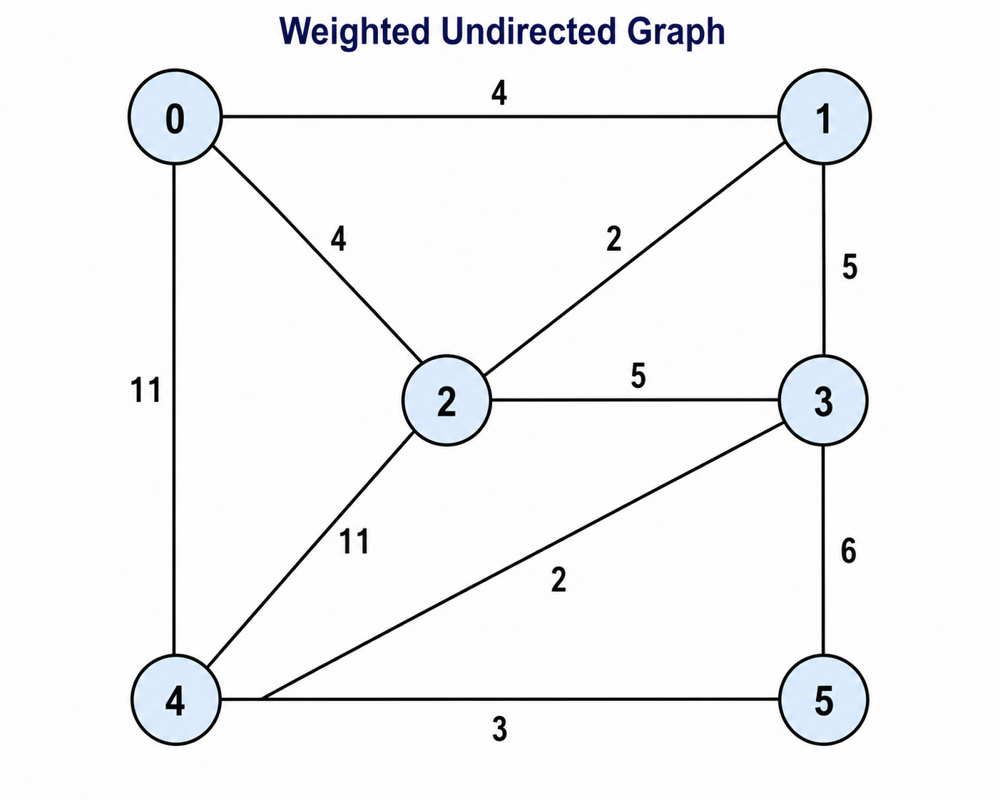
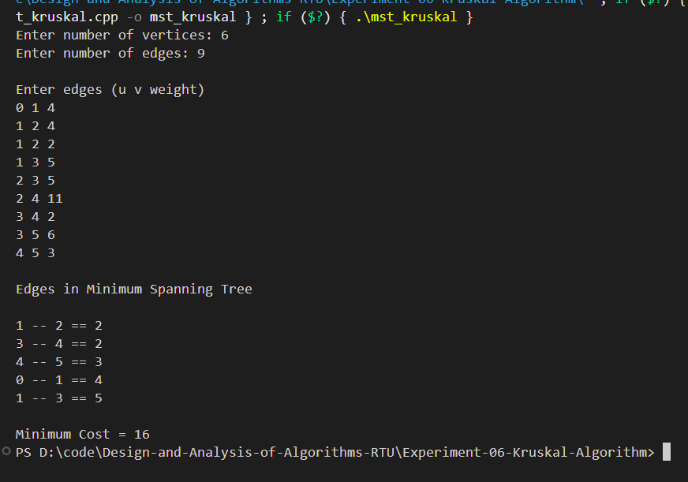

# Experiment 06 - Kruskal's Algorithm

## Aim

Find the Minimum Cost Spanning Tree (MST) of a given undirected weighted graph using Kruskal's Algorithm.

---

## Objective

To implement Kruskal's Algorithm for constructing the Minimum Spanning Tree of a connected weighted graph.

---

## Theory

Kruskal's Algorithm is a greedy algorithm used to find the Minimum Spanning Tree (MST) of a connected weighted graph.

The algorithm sorts all edges in increasing order of weight and repeatedly selects the smallest edge that does not form a cycle until all vertices are connected.

Cycle detection is efficiently performed using the Disjoint Set Union (Union-Find) data structure.

---

## Time Complexity

- **O(E log E)**

Where:

- **V** = Number of Vertices
- **E** = Number of Edges

---

## Space Complexity

- **O(V)**

---

## Algorithm

1. Read the graph.
2. Sort all edges according to weight.
3. Initialize each vertex as its own set.
4. Pick the smallest edge.
5. If it does not create a cycle, include it in the MST.
6. Repeat until **V − 1** edges are selected.
7. Print the Minimum Cost Spanning Tree and its total cost.

---

## Files Included

- **mst_kruskal.cpp** – Kruskal's Algorithm implementation
- **input.txt** – Sample input
- **graph.png** – Weighted graph
- **output_1.png** – Output screenshot
- **README.md** – Documentation

---

## Graph Used

<p align="center">

</p>

---

## Sample Input

```text
6
9

0 1 4
0 2 4
1 2 2
1 3 5
2 3 5
2 4 11
3 4 2
3 5 6
4 5 3
```

---

## Sample Output

```text
Edges in Minimum Spanning Tree

1 -- 2 == 2
3 -- 4 == 2
4 -- 5 == 3
0 -- 1 == 4
1 -- 3 == 5

Minimum Cost = 16
```

---

## Output Screenshot

<p align="center">

</p>

---

## Requirements

- C++ Compiler
- VS Code
- g++

---

## How to Run

Compile

```bash
g++ main.cpp -o kruskal
```

Run

```bash
mst_kruskal.exe
```

---

## Applications

- Network Design
- Road Construction
- Telecommunication Networks
- Electrical Grid Design
- Computer Networks

---

## Advantages

- Simple greedy approach.
- Efficient using Union-Find.
- Produces Minimum Cost Spanning Tree.

---

## Limitations

- Works only for connected graphs.
- Does not handle directed graphs.

---

## Result

The Minimum Cost Spanning Tree of the given graph was successfully generated using Kruskal's Algorithm. The total minimum cost was calculated correctly.

---

## Keywords

Design and Analysis of Algorithms, Kruskal Algorithm, Minimum Spanning Tree, MST, Greedy Algorithm, Graph Algorithm, C++, RTU Lab, DAA Lab
