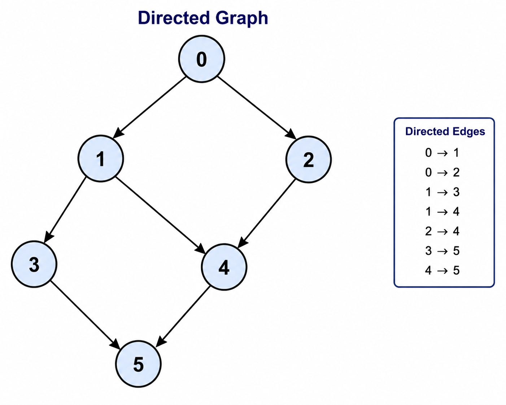
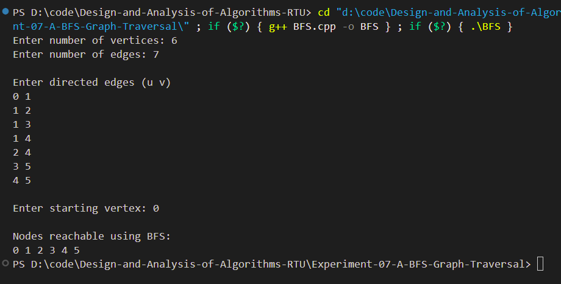

# Experiment 07(a) - Breadth First Search (BFS)

## Aim

Print all the nodes reachable from a given starting node in a directed graph using Breadth First Search (BFS).

---

## Objective

To implement the Breadth First Search (BFS) algorithm for traversing a directed graph and visiting all reachable vertices from a given source vertex.

---

## Theory

Breadth First Search (BFS) is a graph traversal algorithm that explores vertices level by level.

It starts from a source vertex, visits all its adjacent vertices first, and then moves to the next level.

BFS uses a Queue data structure.

---

## Time Complexity

- **O(V + E)**

Where

- V = Number of Vertices
- E = Number of Edges

---

## Space Complexity

- **O(V)**

---

## Algorithm

1. Read the graph.
2. Select the starting vertex.
3. Mark it as visited.
4. Insert it into the queue.
5. Remove one vertex from the queue.
6. Visit all its unvisited adjacent vertices.
7. Repeat until the queue becomes empty.

---

## Files Included

- **bfs.cpp** – BFS implementation
- **input.txt** – Sample input
- **graph.png** – Directed graph
- **output_1.png** – Output screenshot
- **README.md** – Documentation

---

## Graph

<p align="center">

</p>

---

## Sample Input

```text
6
7

0 1
0 2
1 3
1 4
2 4
3 5
4 5

0
```

---

## Sample Output

```text
Nodes reachable using BFS

0 1 2 3 4 5
```

---

## Output Screenshot

<p align="center">

</p>

---

## Requirements

- C++ Compiler
- VS Code
- g++

---

## How to Run

Compile

```bash
g++ bfs.cpp -o bfs
```

Run

```bash
bfs.exe
```

---

## Applications

- Shortest Path in Unweighted Graph
- Web Crawling
- Network Broadcasting
- Social Networks
- GPS Navigation
- AI Search

---

## Advantages

- Simple to implement
- Finds shortest path in unweighted graphs
- Visits vertices level by level

---

## Limitations

- Requires more memory than DFS
- Not suitable for very large graphs

---

## Result

The Breadth First Search algorithm successfully traversed the directed graph and printed all reachable vertices from the given starting node.

---

## Keywords

Design and Analysis of Algorithms, BFS, Breadth First Search, Graph Traversal, Queue, Directed Graph, C++, RTU Lab, DAA Lab