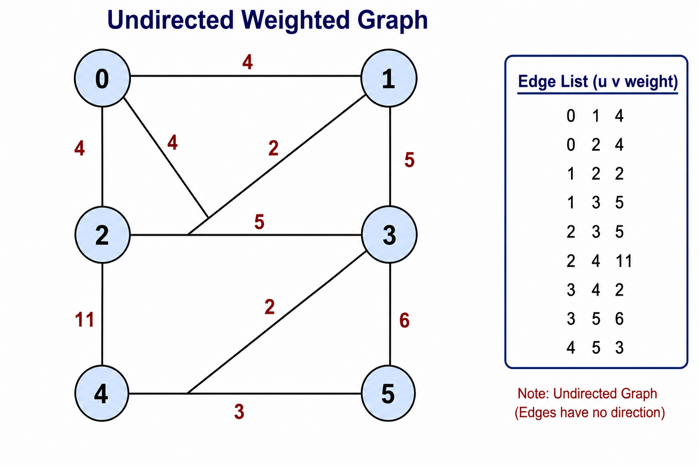
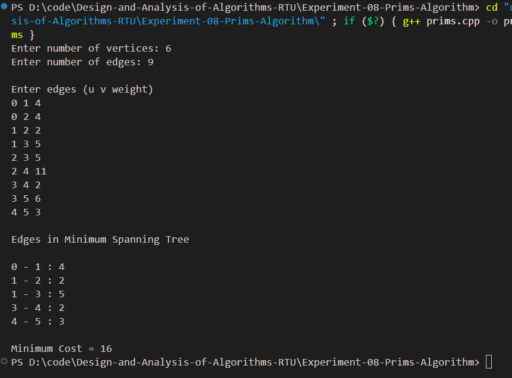

# Experiment 08 - Minimum Cost Spanning Tree using Prim's Algorithm

## Aim

To find the Minimum Cost Spanning Tree (MST) of a given undirected weighted graph using Prim's Algorithm.

---

## Objective

Implement Prim's Algorithm to construct a Minimum Spanning Tree by selecting the minimum weight edge at each step without forming a cycle.

---

## Theory

A **Minimum Spanning Tree (MST)** is a subset of the edges of a connected, weighted, undirected graph that:

- Connects all the vertices.
- Contains exactly **(V − 1)** edges.
- Does not contain any cycle.
- Has the minimum possible total edge weight.

**Prim's Algorithm** is a greedy algorithm that starts from any vertex and repeatedly adds the minimum weight edge connecting a visited vertex to an unvisited vertex until all vertices are included in the MST.

---

## Algorithm

1. Read the number of vertices and edges.
2. Create an adjacency matrix for the graph.
3. Initialize:
   - Key array with infinity.
   - Parent array with -1.
   - MST set as false.
4. Choose the first vertex as the starting vertex.
5. Repeat until all vertices are included:
   - Select the unvisited vertex having the minimum key value.
   - Include it in the MST.
   - Update the key values of its adjacent vertices.
6. Print the edges of the Minimum Spanning Tree.
7. Calculate the total minimum cost.

---

## Time Complexity

**O(V²)**

(Adjacency Matrix Implementation)

---

## Space Complexity

**O(V²)**

---

## Files Included

- **prims.cpp** – C++ implementation of Prim's Algorithm
- **input.txt** – Sample input
- **graph.png** – Weighted graph used in the experiment
- **output_1.png** – Output screenshot
- **README.md** – Documentation

---

## Graph

<p align="center">

</p>

---

## Sample Input

```text
6
9

0 1 4
0 2 4
1 2 2
1 3 5
2 3 5
2 4 11
3 4 2
3 5 6
4 5 3
```

---

## Sample Output

```text
Enter number of vertices: 6
Enter number of edges: 9

Edges in Minimum Spanning Tree

0 - 1 : 4
1 - 2 : 2
1 - 3 : 5
3 - 4 : 2
4 - 5 : 3

Minimum Cost = 16
```

---

## Output Screenshot

<p align="center">

</p>

---

## Requirements

- C++ Compiler (GCC / G++)
- Visual Studio Code / CodeBlocks / Dev C++
- Windows / Linux / macOS

---

## How to Compile

```bash
g++ prims.cpp -o prims
```

---

## How to Run

```bash
./prims
```

or on Windows

```bash
prims.exe
```

---

## Applications

- Network Design
- Road Construction
- Railway Network Planning
- Telephone Networks
- Electrical Power Distribution
- Water Supply Networks
- Computer Network Routing

---

## Advantages

- Simple greedy algorithm.
- Produces the Minimum Spanning Tree.
- Efficient for dense graphs.
- Guarantees minimum total edge weight.

---

## Limitations

- Applicable only to connected graphs.
- Works only for undirected weighted graphs.
- Adjacency matrix implementation is less efficient for sparse graphs.

---

## Result

The Minimum Cost Spanning Tree of the given undirected weighted graph was successfully generated using Prim's Algorithm. The total minimum cost obtained is **16**.

---

## Keywords

Prim's Algorithm, Minimum Spanning Tree, MST, Greedy Algorithm, Weighted Graph, Graph Theory, C++, Design and Analysis of Algorithms, RTU Lab.