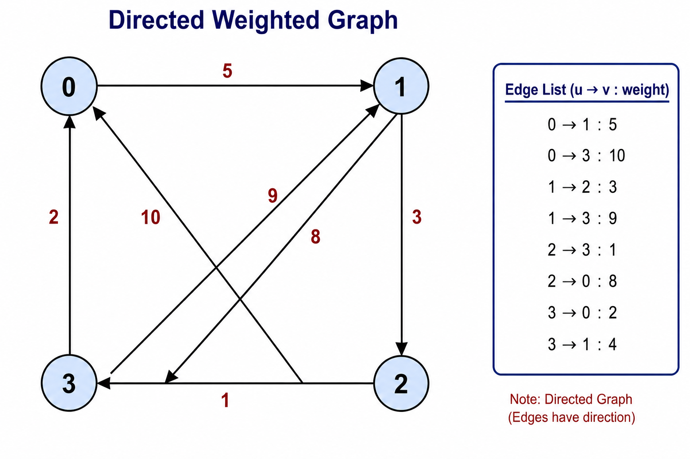
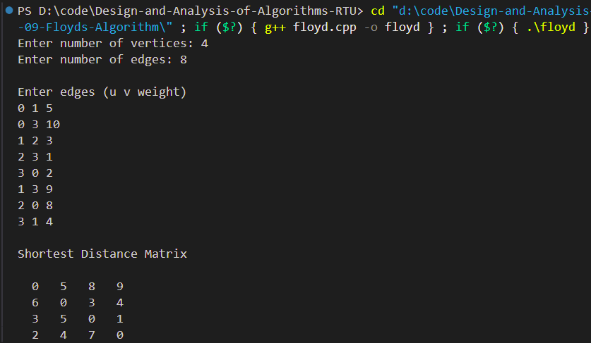

# Experiment 09 - All-Pairs Shortest Paths using Floyd's Algorithm

## Aim

To find the shortest path between every pair of vertices in a weighted graph using Floyd's Algorithm.

---

## Objective

Implement Floyd's Algorithm to compute the shortest distances between all pairs of vertices.

---

## Theory

Floyd's Algorithm (also known as the Floyd–Warshall Algorithm) is a dynamic programming algorithm used to find the shortest paths between every pair of vertices in a weighted graph.

The algorithm works by considering every vertex as an intermediate vertex and continuously updating the shortest path matrix.

It works for:

- Directed Graphs
- Undirected Graphs
- Positive edge weights
- Negative edge weights (without negative cycles)

---

## Algorithm

1. Read the graph.
2. Create the distance matrix.
3. Initialize diagonal elements as 0.
4. Set unreachable paths as INF.
5. Consider each vertex as an intermediate vertex.
6. Update shortest distances.
7. Print the final shortest distance matrix.

---

## Time Complexity

**O(V³)**

---

## Space Complexity

**O(V²)**

---

## Files Included

- floyd.cpp
- input.txt
- graph.png
- output_1.png
- README.md

---

## Graph

<p align="center">

</p>

---

## Sample Input

```text
4
8

0 1 5
0 3 10
1 2 3
2 3 1
3 0 2
1 3 9
2 0 8
3 1 4
```

---

## Sample Output

```text
0   5   8   9
6   0   3   4
3   5   0   1
2   4   7   0
```

---

## Output Screenshot

<p align="center">

</p>

---

## Requirements

- C++ Compiler
- Visual Studio Code
- g++

---

## How to Compile

```bash
g++ floyd.cpp -o floyd
```

---

## How to Run

```bash
./floyd
```

Windows

```bash
floyd.exe
```

---

## Applications

- GPS Navigation
- Network Routing
- Airline Route Planning
- Social Networks
- Traffic Analysis
- Computer Networks

---

## Advantages

- Finds shortest path between every pair of vertices.
- Simple dynamic programming approach.
- Handles negative edge weights.

---

## Limitations

- Does not work with negative cycles.
- High time complexity for very large graphs.

---

## Result

Successfully computed the shortest distance between every pair of vertices using Floyd's Algorithm.

---

## Keywords

Floyd Algorithm, Floyd-Warshall, All Pairs Shortest Path, Dynamic Programming, Graph Algorithms, DAA Lab, RTU, C++