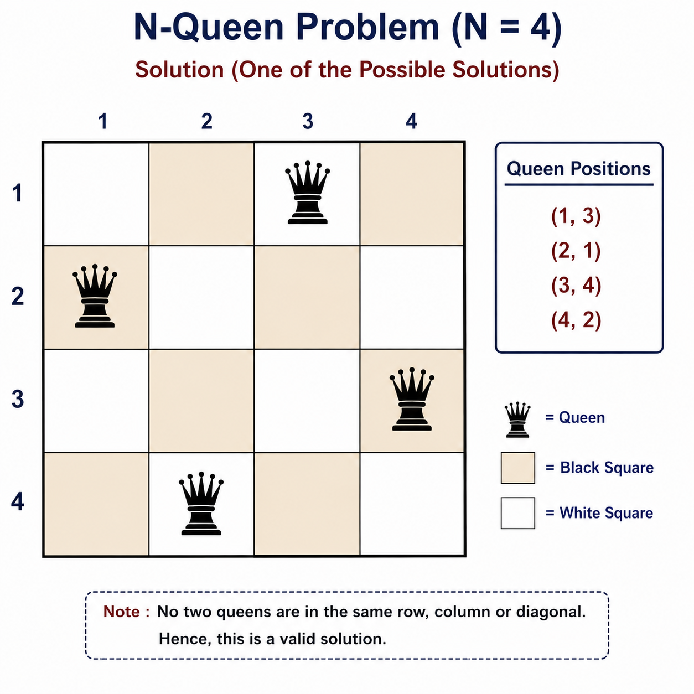
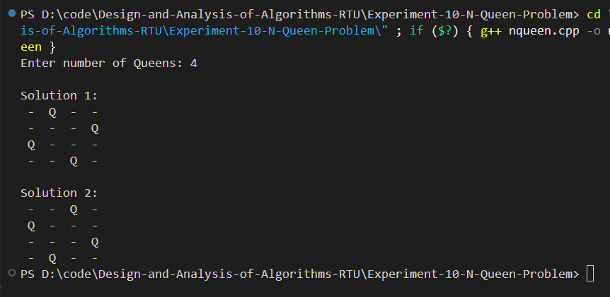

# Experiment 10 - N Queen Problem using Backtracking

## Aim

Implement the N Queen Problem using Backtracking.

---

## Objective

To place N queens on an N × N chessboard such that no two queens attack each other.

---

## Theory

The N Queen Problem is a classic Backtracking problem.

The objective is to place N queens on an N × N chessboard so that:

- No two queens are in the same row.
- No two queens are in the same column.
- No two queens are on the same diagonal.

Backtracking recursively places queens column by column and backtracks whenever an unsafe position is encountered.

---

## Algorithm

1. Start from the first column.
2. Place a queen in a safe row.
3. Recursively place queens in the next column.
4. If no safe position exists, backtrack.
5. Continue until all queens are placed.

---

## Time Complexity

**O(N!)**

---

## Space Complexity

**O(N²)**

---

## Files Included

- **nqueen.cpp** – Backtracking implementation
- **input.txt** – Sample input
- **chessboard.png** – Solution visualization
- **output_1.png** – Output screenshot
- **README.md** – Documentation

---

## Chessboard Solution

<p align="center">

</p>

---

## Sample Input

```text
4
```

---

## Sample Output

```text
Solution

. . Q .
Q . . .
. . . Q
. Q . .
```

---

## Output Screenshot

<p align="center">

</p>

---

## Requirements

- C++ Compiler
- VS Code / CodeBlocks
- g++

---

## How to Compile

```bash
g++ nqueen.cpp -o nqueen
```

---

## How to Run

```bash
./nqueen
```

Windows

```bash
nqueen.exe
```

---

## Applications

- Artificial Intelligence
- Constraint Satisfaction Problems
- Puzzle Solving
- Scheduling Problems
- Game Development

---

## Advantages

- Efficient Backtracking solution.
- Avoids unnecessary computations.
- Demonstrates recursive problem solving.

---

## Limitations

- Time complexity grows rapidly for large values of N.
- Computationally expensive for large chessboards.

---

## Result

Successfully solved the N Queen Problem using the Backtracking technique by placing all queens without conflicts.

---

## Keywords

N Queen Problem, Backtracking, Recursion, Chessboard, Constraint Satisfaction, Design and Analysis of Algorithms, RTU Lab, C++